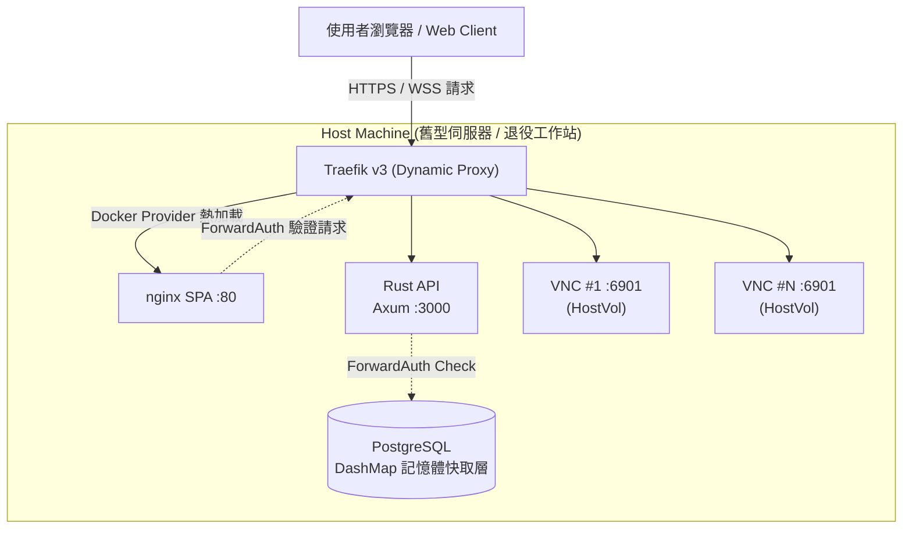
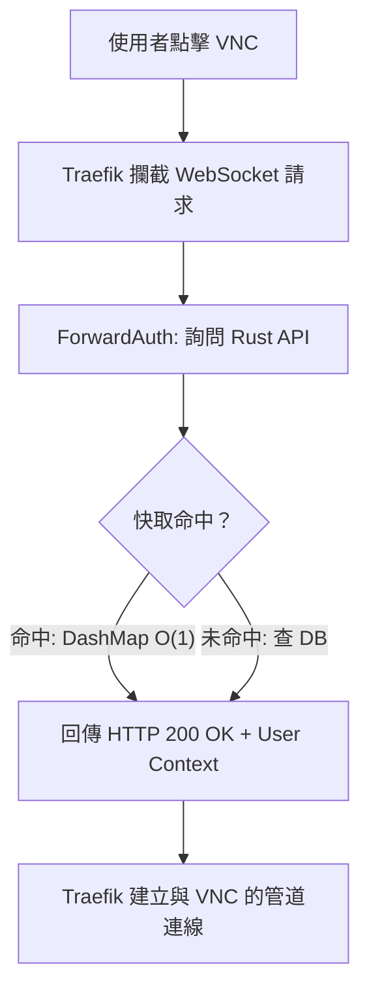
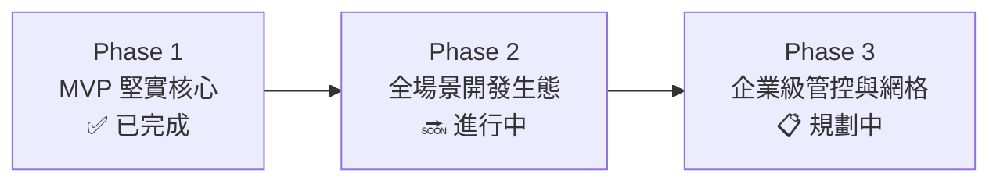

# OpenWorkspace Engine

### 舊資產極致活化與模組化雲端工作區平台

> **「不需要天價預算，讓每一台舊伺服器榨出 300% 的極致算力。」**

OpenWorkspace Engine 是一款專為學術機構與中小型研發團隊設計的**多租戶雲端工作區引擎**。透過輕量化容器編排、動態反向代理與邊緣授權機制，將原本即將淘汰的舊型伺服器與退役工作站，轉化為「開啟瀏覽器即可使用」的高效能現代化雲端開發環境。

---

## 1. 核心痛點：AI 時代下的資產斷層與維護困境

在生成式 AI 與大語言模型急速發展的當下，硬體資源價格呈爆發性成長。  
多數組織的預算成長速度遠趕不上硬體通膨，造成了嚴重的資產困境：

| 核心痛點 | 現狀與影響 | 傳統做法的局限 |
| --- | --- | --- |
| **硬體通膨（Hardware Inflation）** | DRAM 與高階 GPU 價格暴漲，學校實驗室與中小企業採購新設備的門檻被無限拉高。 | 只能將有限預算花在少數頂規機器上，無法滿足多人日常開發需求。 |
| **資產閒置（Resource Waste）** | 2–5 年前的舊伺服器雖無法跑大型 LLM，但其多核心 CPU 與數百 GB 記憶體依然強大，卻因缺乏管理工具而荒廢。 | 舊設備淪為機房「電子垃圾」或只執行單一低負載 Task，整體利用率不到 10%。 |
| **環境污染（Environment Chaos）** | 所有人直接在宿主機安裝 CUDA / Python 套件，導致 Driver 衝突、系統毀損，維護成本極高。 | 遇到問題動輒重灌，導致實驗數據遺失與極大的維護負擔。 |
| **資源壟斷（Resource Monopoly）** | 「一人佔用一整台實體機」，使用者在寫論文、睡覺時，高達 90% 以上的 CPU/RAM 資源處於無效閒置。 | 傳統分配機制缺乏彈性，其他人無資源可用，造成嚴重「資源不公」。 |

---

## 2. 核心價值：極致資源效率與絕不妥協的體驗

OpenWorkspace Engine 不鼓吹盲目追求最新規格，而是以「極致資產活化（Resource Reclaiming）」**與**「綠色 IT 永續營運」為核心，達到商業與技術的雙重勝利。

### 核心價值四大支柱

1. **極致資產活化（Hyper-Efficiency）**
以 Docker 容器全面替代傳統重型 VM（KVM/Proxmox），徹底消除 Hypervisor 15–20% 的硬體開銷。即使是 8GB–16GB RAM 的舊主機，也能流暢運行多個隔離的開發環境。
2. **動態資源調配（Dynamic Allocation）**
打破「專機專用」迷思，按需建立、離開即自動停用，硬體資源永不閒置，創造高密度的多租戶共享環境。
3. **瀏覽器即入口（Browser-as-an-Entry）**
使用者端零設定、免安裝任何軟體或 VPN。開網頁即可存取完整 GUI 桌面與開發工具，達到完全的「開箱即用」。
1. **安全隔離護城河（Zero-Trust Isolation）**
容器級別環境隔離 + JWT 動態權限 + Traefik ForwardAuth 閘道驗證，搭配 cgroups 硬體軟限制與 Host Volume 持久化，確保多租戶環境安全無虞。

### 效能突破：傳統 VM vs OpenWorkspace Engine 量化實測

| 指標項 | 傳統 Proxmox / KVM (VM 模式) | OpenWorkspace Engine (Docker 模式) | 效益提升 |
| --- | --- | --- | --- |
| **單一工作區靜態開銷** | Base OS 需佔用 **1.5 – 2.0 GB** 記憶體 | VNC 容器僅佔用 **~250 MB** 記憶體 | **記憶體節省 80%+** |
| **環境啟動速度 (Time-to-Ready)** | 45 秒 – 60 秒（等待系統開機） | **< 3 秒**（容器啟動 + Traefik 路由熱加載） | **連線速度快 15 倍** |
| **16GB 舊主機最大密度** | 僅能極限容納 **5–6 個** 實例 | **15–20 個** 動態工作區實例 | **資源容納密度提升 3 倍** |
| **資料安全與復原** | 實例損毀需重灌 VM 或載入全量 Snapshot | **Host Volume 實時持久化**，容器毀損 1 秒重建 | **維護成本趨近於零** |
| **記憶體讀寫效能** | Hypervisor 虛擬化開銷導致記憶體頻寬暴跌至原速度 **~10%** | **無額外虛擬化開銷**，直接存取實體記憶體 | **效能無損失** |
| **磁碟讀寫效能** | 虛擬磁碟層 (vDisk) 導致 I/O 讀寫速度降低 **~10% 或更多** | **原生檔案系統掛載**，無虛擬磁碟瓶頸 | **效能無損失** |

---

## 3. 目標使用場景與產品落地效益

### 場景 A：學術與研究實驗室 (Academic Research Labs)

* **現實痛點**：碩一新生入門需要建置環境，學長畢業後機器變成無人敢動的「黑箱」；指導教授缺乏透明的資源監控手段。
* **落地效益**：教授一次性部署平台，建立好預設的 PyTorch / Data Science 模板。新生登入即用，畢業後一鍵銷毀容器、釋放資源，舊伺服器永久循環使用，經驗與資源完美傳承。

### 場景 B：中小型研發團隊與新創 (Tech Teams & Startups)

* **現實痛點**：公有雲（AWS/GCP）VM 費用居高不下，本地開發環境因 Windows/Mac/Linux 差異經常出現「在她電腦能跑，在她電腦不能跑」的相容性災難。
* **落地效益**：將辦公室舊機房集結成私人雲端工作區，統一團隊開發環境。顯著降低 CAPEX（資本支出）與 OPEX（營運支出），同時獲得與雲端平台無異的開發體驗。

---

## 4. 技術架構與極致控制面設計

OpenWorkspace Engine 的控制面（Control Plane）採用 **Rust + Svelte 5** 打造，全站執行期記憶體消耗低於 50MB，將 99% 的舊伺服器硬體資源完整保留給使用者的工作區負載。

### 4.1 系統架構圖

### 4.2 現代化技術棧選型

| 層級 | 技術選型 | 選擇理由與極致效能優勢 |
| --- | --- | --- |
| **控制面 API** | **Rust + Axum 0.8** | 零成本抽象、極低記憶體開銷（<20MB），高併發非阻塞 I/O，確保系統穩定度。 |
| **前端 Dashboard** | **SvelteKit 2 + Svelte 5** | Runes 響應式引擎，編譯為純靜態 SPA，不消耗宿主機 SSR CPU 算力。 |
| **遠端桌面** | **KasmVNC** | 瀏覽器原生 HTML5 Canvas 渲染，不需任何外掛，支援流暢 WebSocket 傳輸。 |
| **動態網關** | **Traefik v3** | 原生支援 Docker Provider，透過 Container Labels 自動偵測與動態路由熱加載。 |
| **容器編排** | **bollard 0.18** | Rust 原生 Docker API API 綁定，實現精確、非同步的容器生命週期控制。 |
| **快取與資料庫** | **PostgreSQL 18 + DashMap** | 持久化資料庫搭配 Rust 原生 Concurrent HashMap，提供 $O(1)$ 的極速 Token 驗證。 |

### 4.3 高效請求路由與 ForwardAuth 安全機制

Traefik 依據路徑長度與優先級進行動態分流，確保控制面與數據面安全解耦：

| 請求路由 (Path) | 目標服務 (Target) | 認證機制 (Auth) | 核心用途 |
| --- | --- | --- | --- |
| `/api/*` | Rust API (`:3000`) | JWT Cookie (`ow_token`) | 管理員與使用者 REST API 指令 |
| `/vnc/{token}/websockify` | VNC 容器 (`:6901`) | ForwardAuth (`/api/vnc/verify`) | 數據面 WebSocket 雙向安全串流 |
| `/vnc/{token}` | nginx (`:80`) | 存取權限校驗 | 載入前端 VNC Viewer 控制外殼 |
| `/` | nginx (`:80`) | 公開 (Public) | 載入 SvelteKit SPA 管理儀表板 |

---

## 5. 產品戰略發展藍圖 (Strategic Roadmap)

### ✅ Phase 1：MVP 核心基礎設施（已完成）

* **動態路由熱加載**：Traefik Docker Provider 自動感知容器增刪，達到零停機路由更新。
* **無縫身份驗證**：JWT Cookie + Traefik ForwardAuth，構建無懈可擊的多租戶安全隔離。
* **高密度生命週期編排**：Rust `bollard` 引擎精確控制容器啟動、停止、資源配額與銷毀。
* **資料安全護城河**：預設自動掛載 Host Volume（`/home/kasm-user/workspace`），確保「容器隨時可銷毀，資料永遠不遺失」。
* **硬體防暴走機制**：建立容器時預設注入 CPU Cores 與 Memory cgroups 硬限制，防止單一租戶耗盡宿主機資源。
* **極速快取架構**：DashMap 記憶體快取層處理 WebSocket 握手驗證，完全避免資料庫性能瓶頸。

### 🔜 Phase 2：開發者多模態生態系（進行中）

* **AI / 資料科學模組 (Jupyter Lab Integration)**：提供預載 PyTorch / CUDA / Data Science 工具鏈的模板，支援大流量 WebSocket 動態代理。
* **高效能網頁 CLI (ttyd Terminal)**：整合 C 語言開發的輕量化 `ttyd`（<10MB RAM），提供極速網頁 Terminal 體驗。
* **本機 CLI 代理 (SSH ProxyCommand)**：提供標準 `ssh-config` 腳本，讓使用者可以在本機 Terminal 直接透過 WebSocket 隧道連入雲端工作區。
* **閒置自動休眠 (Auto-Sleep)**：自動偵測無流量狀態，暫停容器釋放記憶體，點擊時毫秒級喚醒。

### 📋 Phase 3：企業級網格與自動化營運（規劃中）

* **Tailscale 內網 mesh 整合 (Sidecar 模式)**：為工作區注入專屬邊車，讓舊伺服器無需暴露公網 IP，使用者即可透過私人 Mesh 網路直連。
* **管理者全景儀表板 (Cluster Monitor)**：即時視覺化監控宿主機 CPU/RAM/Disk 負載與租戶資源用量。
* **API Key 與審計日誌 (Audit Logging)**：完整的操作軌跡追蹤，滿足組織資安與合規性要求。

## 💡 我們的信念 (Our Mission)

在硬體成本高企的時代，我們相信**強大的開發環境不該只屬於擁有天價預算的團隊**。

OpenWorkspace Engine 旨在打破硬體門檻：
1. **極致活化 (Targeted Realism)**：讓舊設備重獲新生，解決學術與中小型團隊的硬體焦慮。
2. **綠色永續 (Pragmatic Sustainability)**：極大化硬體利用率，用軟體工程的優化代替無止盡的硬體堆疊。
3. **極致體驗 (Uncompromised DX)**：底層再舊，給開發者的體驗也必須是現代、流暢且開箱即用的。

---

如果這個專案解決了你的硬體痛點，歡迎給我們一個 ⭐️ **Star**，或是提交 PR 一起完善它！