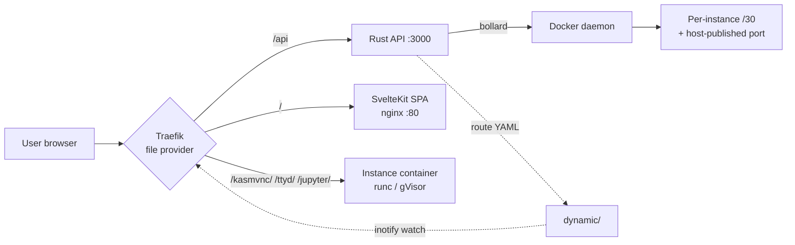

# [OpenWorkspace Engine](https://github.com/TsukiSama9292/OpenWorkspace-Engine)

**Don't buy overpriced RAM — revive your idle servers for your team.**

> 64 GB of DDR5 now costs around **$950** — more than an AR-15 rifle ($600). Your 2–5 year old servers already have that RAM — sitting idle below 10% utilization.

**OpenWorkspace Engine** turns any single Linux box into a **multi-tenant cloud dev environment (Cloud IDE / CDE)**: isolated desktops, Jupyter Lab, and terminals in the browser — with group-based access control, per-instance network isolation, auto-sleep, and persistent user data. The entire control plane idles at **~68 MB RAM**.

---

## Quickstart

**Production** — one command from the repo root:

```bash
docker compose -f docker/openworkspace/docker-compose.yml up -d
```

Instance template images are built (`pnpm run build:template-images`) or pulled from Docker Hub — see [Run it yourself](#run-it-yourself).

**Development** — full stack (Traefik + PostgreSQL + Rust API + web dev server):

```bash
pnpm run dev
```

<video controls src="https://github.com/user-attachments/assets/b533a9a8-7690-4568-bf81-6bd09e629c1f" width="100%">
  Your browser does not support the video tag.
</video>

---

## Product Vision

### Core Pain Points

| Pain Point | Impact |
|---|---|
| **Hardware Inflation** | DRAM/GPU prices outpace budgets; labs and SMBs can't refresh hardware |
| **Resource Waste** | 2-5 year old servers with multi-core CPU + GB RAM sit idle (<10% utilization) |
| **Environment Chaos** | Direct host installation of CUDA/Python causes driver conflicts and system corruption |
| **Resource Monopoly** | One person occupies a whole machine; 90%+ CPU/RAM idle during off-hours |

### Value Pillars

1. **Hyper-Efficiency** — Docker containers eliminate 15-20% VM overhead; 8GB RAM hosts run multiple isolated environments
2. **Dynamic Allocation** — Create on demand, auto-stop when idle; hardware never sits unused
3. **Browser-as-Entry** — Zero client setup, no VPN; full GUI desktop in browser
4. **Zero-Trust Isolation** — Container isolation + JWT auth + per-instance networks + cgroups limits

### Beliefs

1. **Targeted Realism** — Revive old hardware; solve the hardware anxiety of academic and small teams
2. **Pragmatic Sustainability** — Maximize utilization through software optimization, not endless hardware stacking
3. **Uncompromised DX** — The underlying hardware may be old, but the developer experience must be modern, smooth, and out-of-the-box

---

## Design Philosophy: Security · Stability · Performance

This project is engineered to reach a **balanced optimum of `Security`, `Stability`, and `Performance`**. Every layer is chosen for a deliberate trade-off — no single property is maximized at the expense of the others:

| Layer | Technology | What it buys us |
|---|---|---|
| **Control Plane API** | Rust | **Security + Performance** — memory safety with zero-cost abstractions; <35MB RAM, high-concurrency non-blocking I/O |
| **Frontend** | SvelteKit | **Performance + DX** — ships a lightweight static SPA (small bundle, fast load) without abandoning development convenience (runes reactivity, batteries-included tooling) |
| **Reverse Proxy** | Traefik | **Stability + Performance** — efficient reverse proxying with **zero-downtime config** (file provider + inotify hot-reload; a bad/added route never requires a restart) |
| **Static Asset Serving** | Nginx | **Performance** — HTTP caching eliminates the I/O bottleneck of repeated asset requests |
| **Container Runtime** | Docker OCI + **runC** | **Performance** — fast instance creation with the standard OCI runtime |
| **Container Runtime (hardened)** | **gVisor (runsc)** | **Security** — a user-space kernel intercepts syscalls, drastically reducing container-escape risk; selectable per template as an alternative to runC |
| **Instance Networking** | Per-instance `/30` + host-published ports | **Security (network segmentation)** — see below |

### Flexible Runtime Philosophy: performance when you need it, security when you demand it

Different workloads need different trade-offs. OpenWorkspace-Engine lets administrators choose the container runtime **per template, directly from the web UI** — not a platform-wide gamble:

- **runC — 100% native host performance.** For trusted internal teams, heavy AI/ML training (LLM fine-tuning), or CUDA workloads where syscall interception would cost a few percent, keep the template on standard `runC`: no virtualization layer, raw host speed.
- **gVisor (runsc) — hardened multi-tenant isolation.** For guest users, untrusted code execution, or in-workspace Docker daemons (`_dini`), switch the template to `runsc` with one click: a user-space kernel intercepts syscalls and drastically reduces container-escape risk. NVProxy GPU passthrough works on both runtimes.

**Trust your team → runC at full hardware speed. Let in a stranger or a risky workload → one click to gVisor.**

### Why per-instance `/30` networks instead of one shared subnet

Managing every instance on a single flat virtual subnet (e.g. one `/16` or `/24`) is convenient, but it is also a **lateral-movement attack surface**: a compromised user could scan the shared segment and attack other instances from inside the network.

To reduce the attack surface at the network layer *before* it becomes a problem:

- The instance's **remote service port is published directly to a host port on the Docker bridge gateway** (`<host_gateway_ip>:<host_port>`) — Traefik reaches it via `host.docker.internal:<host_port>`, never a container IP.
- **Outbound internet access uses a dedicated `/30` subnet per instance**. A `/30` is the smallest subnet that exists: its four addresses are exactly the **network, gateway, broadcast, and the instance (container) itself** — nothing is left over. With no peer instances on the same broadcast domain, **east-west attacks between instances are structurally impossible**.

This is network-level isolation taken to its extreme: each container lives in its own bubble, and the only entrance to it is the single Traefik-controlled published port.

Because ports and `/30`s are finite pools shared by all instances on a host, they are handed out under non-blocking `flock` lockfiles (see [docs/developer-guide/lock-registry.md](docs/developer-guide/lock-registry.md)) — no two API processes can ever allocate the same port or subnet, even under concurrent launches.

---

## Measured resource footprint

We benchmarked the full production stack on a real host (i5-12400F, 32 GB DDR4-2666) — see the [analysis & methodology](docs/analysis/production-benchmark/README.md) and the [raw run report](docs/analysis/production-benchmark/2026-08-06-235532/report.md). With six idle instances running alongside, at rest:

- **The platform itself is nearly free.** Traefik + PostgreSQL + web + API idle at a **combined peak of ~68 MB RAM** (a full static SPA served by nginx, a Rust API at ~3 MB) and under ~4% peak CPU. Control-plane overhead is a rounding error next to even one instance.
- **Pick the runtime by trust, not by habit.** For a deployment serving **trusted internal staff**, keep the **Docker default runtime (runC)**. gVisor's sandbox costs a KasmVNC desktop **≈ 8.6× CPU and ≈ 2.8× memory** at idle (904 MB vs 320 MB). Reserve `runsc` (gVisor) for untrusted / multi-tenant workloads where containment is worth the overhead. Runtime is a per-template option, so you can mix both on one host — runC for your internal dev teams, runsc for guests.
- **No desktop, no problem.** Users who only need a shell or Python shouldn't pay for a GUI: **ttyd terminals (~45 MB, ~0.2% CPU under runC)** and **Jupyter Lab (~172 MB, ~0.1% CPU)** run at near-zero overhead and skip the 320–904 MB desktop entirely.

---

## How OpenWorkspace compares

A rough side-by-side for a single shared box. Only our own column is measured — the rest come from project docs and community reports, so treat them as ballpark:

| Dimension | **OpenWorkspace-Engine** | Kasm Workspaces | Coder (v2) |
|---|---|---|---|
| **License** | **Apache 2.0** | Proprietary (free tier capped) | AGPLv3 + Enterprise paywall |
| **Control plane specs** | **2 CPU / 100+ MB / 40 GB recommended** — measured idle **~68 MB RAM** | 2 CPU / 4 GB / 50 GB | 2 CPU / 1 GB |
| **Network isolation** | **Per-instance `/30` out of the box** — no L2/L3 lateral movement | Shared bridge (Docker) / K8s CNI | Shared bridge (Docker) / K8s CNI |
| **Network QoS (bandwidth shaping)** | **Native kernel-level limits per template (`tc`/HTB)** — upload/download Mbps out of the box | None built-in — needs external firewall/gateway or CNI-level setup | None built-in — needs external firewall/gateway or CNI-level setup |
| **Runtime switch** | **runC ↔ gVisor per template from the web UI** | Host/K8s level, manual | Host/K8s level, manual |
| **Docker-in-instance** | **`_dini` templates out of the box** — sandboxed under gVisor, full-privilege under runC (explicit UI warning) | Typically requires `--privileged` | Typically requires `--privileged` |
| **Proxy architecture** | **Traefik + inotify hot-reload (no Docker socket mounted)** | NGINX | Coder proxy (Go) |

**Control plane memory at rest:**

```
K8s + JupyterHub   ~2 GB+
Coder / Gitpod     heavier
OpenWorkspace      ~68 MB   (measured)
```

That idle control plane fits on the N100, mini-PC, or lab server that's already collecting dust — and it stays a rounding error next to even one running instance.

### The true open-source freedom

> **Why Apache 2.0?** Many "open-source" workspace platforms employ a bait-and-switch model: restrictive AGPLv3 licenses, hardcoded session limits, or essential security features locked behind "Enterprise" paywalls. OpenWorkspace-Engine is licensed under **Apache 2.0** — no artificial session limits, no locked features, no restrictions on commercial use. We rely entirely on Apache 2.0-compatible dependencies. If an agency wants to build a commercial SaaS on top of it — go ahead.

| | **OpenWorkspace-Engine** | Kasm Workspaces | Coder |
|---|---|---|---|
| **License** | **Apache 2.0** | Proprietary | AGPLv3 + Enterprise paywall |
| **Concurrent sessions** | **Unlimited** (hardware bound) | Capped (Community Edition) | Unlimited (hardware bound) |
| **Enterprise feature lock** | **None** | Yes (paywalled features) | Yes (OIDC, audit logs, RBAC) |
| **Commercial use** | **Permitted & welcomed** | Restricted in Community Edition | Restricted by AGPLv3 |

---

## Terminology

| Concept | Description |
|---|---|
| **Template** | Pre-configured settings bundle (image, resources, env vars) to launch instances from |
| **Instance** | A running container (desktop, notebook, or terminal) launched from a template |
| **Session** | An instance you have open, plus its state (running / starting / paused / stopped) |
| **User** | Person with an account. Authorization is **group-based** — permissions live on groups (flags, template whitelist, instance ceiling) and are resolved into an effective context per request (see [docs/user-guide/rbac.md](docs/user-guide/rbac.md)) |

---

## Quick Tour

Everything happens in a single-page web app — no install, no VPN. Open the platform's web address, log in, and you're on the dashboard.

1. **Log in.** Accounts are created by an administrator — there is no public sign-up. Your session lasts a week.
2. **Launch a session.** On the **Instances** page, pick a template from the quick-launch grid. In the launch dialog, choose how your data is handled — **Use persistent storage** (default), **No persistent storage**, or **Reset persistent storage** (asks you to confirm). If the platform refuses — a template you can't use, or a limit reached — it tells you exactly why.
3. **Wait for it to start.** The platform auto-detects when the session is ready, then takes you straight in.
4. **Work in the browser.** Desktops (KasmVNC) open as a full screen with clipboard support; terminals (ttyd) and notebooks (Jupyter) open in a tabbed page.
5. **Manage your sessions.** Each card shows status, a persistence badge, a live countdown of any time budget, and what you can do in that state — **Start / Stop** (stop keeps your data), **Pause / Resume** (pause uses almost no CPU), **Open**, **Delete** (data is kept; only a reset erases it).

Your session's address is unique and stable across stops and restarts — you can bookmark it. Full walkthrough: [docs/user-guide/frontend.md](docs/user-guide/frontend.md).

## Permissions & your data

**Who can do what.** Permissions come from **groups**, not per-user roles. Your group grants you the flags you have — which templates you may launch, whether you manage other users' sessions, whether you create templates, and how many sessions you may run at once. Admins and Managers have defined tiers; a lower tier never overrides a higher one. Details: [docs/user-guide/rbac.md](docs/user-guide/rbac.md).

**Your data survives.** With **persistent storage**, your entire home directory — notebooks, terminal history, installed packages, desktop settings — lives on a volume that survives stop, start, and even delete. Only an explicit **reset** wipes it. Two rules keep it predictable:

- **One persistent session per template per user.** A second *use*/*reset* launch is refused while one exists — use the existing session instead.
- **Reset is the only destructive action.** Nothing on the server ever auto-deletes your data.

The server decides where data lives; you can never mount an arbitrary host path into a session. Details: [docs/user-guide/persistent-storage.md](docs/user-guide/persistent-storage.md).

**Your sessions manage themselves.** Each template sets a **run-time budget** (auto-sleep) and an **idle policy** (keep-time). A countdown on the session page warns you before a deadline; the worker reclaims a session that has been idle — tab hidden, unfocused, or never opened — for too long. While the page is open and focused, the idle clock is refreshed, so an active viewer is never reclaimed.

## Isolation you can trust

Every session runs in its own container on its own tiny network — an address space with just four addresses, holding nothing but that one session. **Your session cannot reach another user's session, and theirs cannot reach yours.** This is not "we trust you to behave" isolation; it is structural — there is no shared network segment to scan in the first place.

- Each session is reached only through its unique, unguessable web address, guarded by per-instance credentials the proxy injects server-side — your browser never sees the secrets, and you never log in to a session yourself.
- Access tokens are short-lived, and the proxy validates every request and WebSocket upgrade against the live database.

---

## Architecture



**Key mechanism:** The API generates per-instance Traefik route YAML files into a watched directory. Traefik hot-reloads them via inotify — new sessions are immediately accessible without a proxy restart.

**Network topology:** each instance gets its own `/30` subnet (network + gateway + broadcast + container — the smallest possible segment), plus one host-published port. There is no shared instance subnet, so no lateral movement. See [Why per-instance `/30` networks](#why-per-instance-30-networks-instead-of-one-shared-subnet) above, and [docs/user-guide/architecture.md](docs/user-guide/architecture.md) for the full lifecycle and topology.

## Why this stack

Every layer exists to reach a **balanced optimum of Security, Stability, and Performance** — a true multi-tenant platform. We did not pick technologies for convenience; we picked them for the core philosophy, and we accepted the cost of that choice.

- **Rust for the control plane (not Go, Node, or Python).** This process controls the host's Docker socket and networking — the single most privileged component. Rust's ownership model eliminates memory-safety bugs (use-after-free, data races) at compile time. Python has an official Docker SDK, and it would be far easier to write — but its security, performance, and memory footprint are all inferior. For a shared host, a control plane that idles at well under 35MB of RAM is a feature, not a footnote.
- **SvelteKit as a fully static SPA (not SSR, not React).** `adapter-static` with `ssr = false` means the build is pure static files served by nginx — **zero SSR CPU cost on the shared host**, and a small, fast-loading bundle.
- **Traefik with the File Provider (not the Docker provider, not dynamic nginx).** Routes hot-reload via inotify with zero restarts, and Traefik never mounts the Docker socket — the API (the only component allowed to control containers) is the sole authority over routing.
- **Dual container runtimes: runC + gVisor (runsc).** runC for speed; gVisor's user-space kernel intercepts syscalls to slash container-escape risk, selectable per template — with NVProxy GPU passthrough for supported NVIDIA hardware.
- **PostgreSQL as the single source of truth, with an in-process memory cache.** sqlx checks SQL at compile time and migrations run automatically on startup. The DashMap cache makes token verification an O(1) in-memory lookup. A separate Redis/Valkey is unnecessary today — see [docs/developer-guide/caching-strategy.md](docs/developer-guide/caching-strategy.md).
- **JWT for identity only, permissions recomputed on every request.** The token carries nothing but identity; the effective permissions (group flags, template whitelist, instance ceiling) are re-read from the database per request — a permission change takes effect on the very next request, and a stale token can never retain authority.
- **Per-instance `/30` + host-published ports, allocated under `flock` lockfiles.** The smallest possible network segment per tenant, handed out without races across processes. See [docs/developer-guide/lock-registry.md](docs/developer-guide/lock-registry.md).
- **Local bind-mounted named volumes for persistence.** Server-resolved absolute paths (`{root}/{template_name}/{user_id}`), no client-supplied paths, so no tenant can mount an arbitrary host directory.

Full ADR-style record (in Chinese): [docs/developer-guide/tech-stack.md](docs/developer-guide/tech-stack.md).

## Tech Stack

| Layer | Technology | Version |
|---|---|---|
| **Control Plane API** | Rust + Axum | stable / axum 0.8 |
| **Frontend** | SvelteKit 2 + Svelte 5 (static SPA) | 2.x / 5.x |
| **UI** | Tailwind CSS v4 + Skeleton | v4 |
| **Reverse Proxy** | Traefik | v3.7.4 |
| **Static Asset Serving** | Nginx | latest |
| **Container Orchestration** | bollard (Rust Docker API) | 0.18 |
| **Container Runtime** | Docker OCI (runc) / gVisor (runsc) | ≥ 24 / latest |
| **Database** | PostgreSQL | 18-alpine |
| **In-Memory Cache** | DashMap | — |
| **Network QoS** | Linux `tc`/HTB + `nsenter` | — |
| **Package Management** | pnpm + Turborepo | pnpm 9 / turbo 2 |
| **Instance Images** | KasmVNC / Jupyter Lab / ttyd (built + `_dini` variants) | — |

## Project Structure

```
OpenWorkspace-Engine/
├── apps/
│   ├── api/                    # Rust/Axum REST API
│   │   ├── migration/          # SQLx auto-migrations
│   │   └── src/
│   │       ├── main.rs         # Server entrypoint
│   │       ├── routes/         # HTTP handlers (auth, templates, instances)
│   │       ├── health_worker.rs# Background worker (auto-sleep, keep-time)
│   │       ├── network_qos.rs  # tc/HTB bandwidth shaping logic
│   │       ├── docker.rs       # bollard Docker client
│   │       ├── db.rs           # PostgreSQL repositories
│   │       └── route_writer.rs # Traefik YAML generation
│   └── web/                    # SvelteKit frontend
│       └── src/
│           ├── lib/            # API client, stores, types, VNC components
│           └── routes/         # Pages (dashboard, login, instances, VNC, users)
├── docker/
│   ├── template_images/        # Dockerfiles for instance templates
│   │   ├── Dockerfile.jupyterlab_ubuntu
│   │   ├── Dockerfile.ttyd_ubuntu
│   │   └── Dockerfile.kasmvnc_ubuntu
│   ├── openworkspace/          # Production stack (Traefik + PostgreSQL + web + api)
│   └── openworkspace_dev/      # Dev infrastructure (Traefik + PostgreSQL)
├── scripts/                    # Kill-dev, network creation, cleanup
└── docs/                       # user-guide + developer-guide
```

## Under the hood

- **Dynamic routing** — Traefik file provider with directory watching; new sessions hot-reload in seconds.
- **Cross-tenant isolation** — Every instance protected by a per-instance access token (62<sup>127</sup> combinations, 127 chars from `a-z A-Z 0-9`), injected server-side by the proxy — the browser never sees the secrets.
- **JWT Cookie Auth** — `ow_token` cookie + Traefik ForwardAuth for WebSocket upgrade validation.
- **gVisor sandboxing** — Template-level `Container Runtime` option to select `runsc(gVisor)`, intercepting high-risk syscalls; **GPU passthrough (NVProxy)** for NVIDIA on Turing / Ampere / Ada / Hopper — verified on Turing (GTX 1650) and Ampere (RTX 3060), Maxwell (GTX 970) fails. See [docs/developer-guide/gvison.md](docs/developer-guide/gvison.md)
- **Auto-Sleep (run-time limit)** — Per-template `max_run_seconds`; past the limit, a background worker executes the configured `timeout_action` (`remove` / `stop` / `pause`). A browser countdown warns the user first.
- **Keep Time (idle reclamation)** — Per-template `keep_time_seconds` + `keep_time_action`; the frontend heartbeats every 10s while focused, and the worker reclaims a session idle for longer than the threshold.
- **Network Bandwidth Limiting** — Per-template `network_bandwidth_up_mbps` / `network_bandwidth_down_mbps` (0 = unlimited), enforced in the kernel with `tc`/HTB on the instance's veth pair. Upload is shaped on the container's egress `eth0`, download on the host-side veth; re-applied on every start (Docker recreates the veth pair). Fail-open: shaping errors log and never kill a session.
- **cgroups Resource Limits** — CPU cores + memory hard limits injected at container creation.
- **flock Port/Subnet Registry** — host ports and instance `/30` subnets allocated under non-blocking `flock` lockfiles in a shared per-UID directory; stale-snapshot races are absorbed by a bounded retry from a per-instance spread. See [docs/developer-guide/lock-registry.md](docs/developer-guide/lock-registry.md)
- **Background Lifecycle Worker** — 3-second scan enforcing auto-sleep deadlines and keep-time idle reclamation; a heartbeat resets the idle clock while a tab is focused.

## Run it yourself

### Development

```bash
# Prerequisites: Node.js ≥18, pnpm 9, Rust (stable), Docker + Compose v2

pnpm run dev
```

This runs `kill-dev.sh` → creates the `ow-network` Docker network → starts Traefik + PostgreSQL via Docker Compose → runs the Rust API and Vite dev server concurrently.

> **Dev runs on plain HTTP** — open `http://localhost`. No certificates needed.

### Production

1. **Build (or pull) the template images.** From the repo root:

   ```bash
   # Option A — build locally (recommended; keep images in sync with this repo)
   # Builds the three regular images plus their *_dini (in-instance Docker) variants.
   pnpm run build:template-images
   ```

   ```bash
   # Option B — pull prebuilt images from Docker Hub
   docker pull tsukisama9292/ow-jupyter-ubuntu:jammy
   docker pull tsukisama9292/ow-ttyd-ubuntu:jammy
   docker pull tsukisama9292/ow-kasmvnc-ubuntu:jammy
   docker pull tsukisama9292/ow-jupyter-ubuntu-dini:jammy
   docker pull tsukisama9292/ow-ttyd-ubuntu-dini:jammy
   docker pull tsukisama9292/ow-kasmvnc-ubuntu-dini:jammy
   ```

   > New templates default to the `_dini` images so the `docker_in_instance`
   > switch works out of the box. The regular images remain available for
   > templates that never need an in-instance daemon.

2. **Start the production stack** (Traefik + PostgreSQL + nginx web + Rust API):

   ```bash
   cd /path/to/OpenWorkspace-Engine
   docker compose -f docker/openworkspace/docker-compose.yml up -d
   ```

   The compose file builds `ow-web:latest` and `ow-api:latest` from source, so no separate image build is needed for the platform itself. Instance containers are then launched on demand from the template images above.

   Set secrets via environment variables or a `.env` file next to the compose file: `JWT_SECRET` (change from default), `ADMIN_PASSWORD`, `POSTGRES_USER`/`POSTGRES_PASSWORD`/`POSTGRES_DB`.

> **Note on tc/HTB bandwidth shaping (development only):** when the API runs on the host (`pnpm run dev`), the unprivileged process needs elevated `nsenter`/`tc` capabilities — `pnpm run dev` grants them automatically via `network:allow` (`sudo setcap`). The **production compose runs the API as root inside a container** with `SYS_ADMIN`/`NET_ADMIN`/`SYS_PTRACE` and `pid: host`, so **no host-side setcap is needed there**. Templates with `0` bandwidth limits skip `tc` entirely. See [docs/developer-guide/development.md](docs/developer-guide/development.md).

### HTTPS in Production

This stack serves everything (frontend, `/api`, VNC WebSocket) from one Traefik origin over plain HTTP. For HTTPS, do **not** enable TLS inside Traefik — put a TLS-terminating proxy in front instead:

- **Cloudflare** — enable **Proxied** on your DNS record; TLS is terminated at Cloudflare's edge and forwarded to `:80`. No cert management on your side.
- **Let's Encrypt** — run a front reverse proxy (Traefik ACME, Caddy, or nginx) that obtains certs automatically and proxies to `:80`.

Self-signed/local CA certs are not suitable: Chromium never bypasses certificate errors for `fetch()` subresource calls, so `/api` requests will fail with `ERR_CERT_AUTHORITY_INVALID`. See [docs/developer-guide/development.md](docs/developer-guide/development.md) for details.

See [docs/developer-guide/development.md](docs/developer-guide/development.md) for environment variables, debugging, testing, and the production build.

---

| Documentation | Contents |
|---|---|
| **User guide** ([docs/user-guide/](docs/user-guide/)) — for the most basic user | Architecture, RBAC, persistent storage, remote authentication, and the browser UI walkthroughs |
| **Developer guide** ([docs/developer-guide/](docs/developer-guide/)) — for developers, AI coding agents, and operators | Setup, debugging, production, tech decisions (ADRs), gVisor, caching, and lock-registry |
