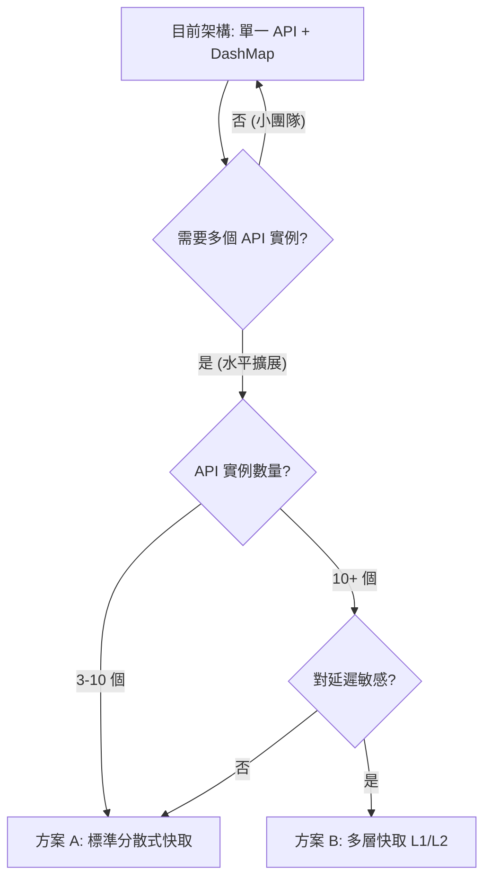

# Caching Strategy

## Current Architecture: Single-Process DashMap

```
┌─────────────────────────────────────────────┐
│  API 進程 (Axum + Tokio)                     │
│                                             │
│  VNC 快取 (DashMap)     ──> O(1) 同步查詢    │
│  ├─ vnc_token → { status, owner_id }       │
│  └─ 啟動時載入，create/start/stop/delete 同步  │
│                                             │
│  PostgreSQL (PgPool)    ──> 備用降級路徑      │
│  └─ 僅在快取 miss 時查詢                      │
└─────────────────────────────────────────────┘
```

### 為什麼 DashMap 已足夠

本專案的目標用戶是學校、實驗室、小團隊，預估 10-50 個 VNC 實例。在這個規模下：

| 指標 | 數值 | 說明 |
|------|------|------|
| instances 表行數 | <100 筆 | 即使不使用快取，index lookup <0.1ms |
| DashMap 查詢延遲 | ~ns | 記憶體 hash lookup，無 I/O |
| PostgreSQL round-trip | ~0.5-1ms | 網路延遲，非查詢時間 |
| WebSocket 握手頻率 | 極低 | 僅在連線建立時，非持續請求 |

**真正的瓶頸不在 API 快取，而在硬體資源：**

| 資源 | 每個 VNC 實例消耗 | 8GB RAM 主機上限 |
|------|------------------|-----------------|
| KasmVNC 容器 RAM | ~200MB | ~40 實例 |
| 瀏覽器記憶體 | ~50MB/tab | ~160 個 tab |
| 網路頻寬 | ~1Mbps/實例 | ~80 實例 |

### 為什麼不需要 Redis/Valkey

1. **單一 API 進程** — DashMap 在進程內永遠 consistent，無需外部同步
2. **無水平擴展需求** — 小團隊場景不需要多個 API 實例
3. **查詢極輕量** — 100 筆資料的 index lookup 本身就是微秒級
4. **零外部依賴** — 不需要額外部署、維護 Redis 服務

---

## Future Scaling: Redis/Valkey

當出現以下任一條件時，才需要考慮引入 Redis/Valkey：

- 多個 API 實例 behind load balancer（水平擴展）
- 單一 API 進程的 CPU 成為瓶頸（幾乎不可能）
- 需要跨進程的快取一致性

### 方案 A：標準分散式快取（最常見）

```
API 實例 1 ┐
API 實例 2 ┼──> [ Redis / Valkey 集群 ] ──> [ PostgreSQL ]
API 實例 3 ┘
```

**架構：**
- 所有 API 實例共享同一個 Redis/Valkey 快取
- Instance 建立/停止時，由處理請求的 API 實例寫入 Redis
- 其他 API 實例的 ForwardAuth 直接查 Redis（~0.1ms）
- 無需本地快取，架構簡單

**優點：**
- 實現簡單，只替換 DashMap 為 Redis client
- 快取一致性天然成立（單一資料源）
- Redis 支援 TTL，可自動清理過期快取

**缺點：**
- 每次 ForwardAuth 多一次 Redis 網路 round-trip
- Redis 宕機時所有 API 實例的 VNC 驗證失效

**適用場景：** 3-10 個 API 實例，需要簡單的共享快取

---

### 方案 B：多層快取 L1/L2 Cache（極致效能）

```
API 實例 1 [DashMap (L1)] ┐
API 實例 2 [DashMap (L1)] ┼──> [ Redis / Valkey (L2) ] ──> [ PostgreSQL ]
API 實例 3 [DashMap (L1)] ┘
          └─(透過 Redis Pub/Sub 廣播同步，或設定極短 TTL，如 2 秒)
```

**架構：**
- L1：每個 API 實例本地 DashMap（~ns 查詢）
- L2：Redis/Valkey 共享快取（~0.1ms 查詢）
- 查詢順序：L1 → L2 → PostgreSQL
- 快取失效：Redis Pub/Sub 廣播或短 TTL 自動過期

**快取同步機制（二選一）：**

```
# 選項 1: Redis Pub/Sub 廣播（即時）
API 實例 A 寫入 DB → 發布 "instance:abc:stopped" →
  → 所有 API 實例收到通知 → 清除本地 DashMap

# 選項 2: 極短 TTL（簡單）
Redis key 設定 TTL=2s → 自動過期 →
  → 下次查詢重新從 DB 載入 → 填入 DashMap
```

**優點：**
- 99% 的查詢命中 L1（DashMap），零網路延遲
- L2 作為 fallback，處理跨進程同步
- Redis 宕機時 L1 仍可服務已知的 instance

**缺點：**
- 實現複雜（兩層快取 + 同步機制）
- 短 TTL 方案有 2 秒不一致窗口
- Pub/Sub 方案需要管理訂閱連線和重連邏輯

**適用場景：** 10+ 個 API 實例，對延遲極度敏感

---

## 決策流程



## 遷移路徑

如果未來需要從 DashMap 遷移到 Redis/Valkey：

1. **替換 `VncCache` 實作** — 介面不變，只改內部實作
2. **加入 Redis 連線** — docker-compose 加 `valkey` service
3. **調整 `vnc_verify`** — 改為 async 呼叫 Redis（`.await`）
4. **部署多個 API 實例** — docker-compose scale + load balancer

核心介面保持不變：

```rust
// 目前 (DashMap)
impl VncCache {
    pub fn get(&self, token: &str) -> Option<CacheEntry> { ... }
    pub fn insert(&self, token: &str, status: &str, owner_id: Uuid) { ... }
    pub fn remove(&self, token: &str) { ... }
}

// 未來 (Redis)
impl VncCache {
    pub async fn get(&self, token: &str) -> Option<CacheEntry> { ... }
    pub async fn insert(&self, token: &str, status: &str, owner_id: Uuid) { ... }
    pub async fn remove(&self, token: &str) { ... }
}
```

只需修改 `vnc_verify` 和 instance lifecycle handlers 加上 `.await` 即可。
