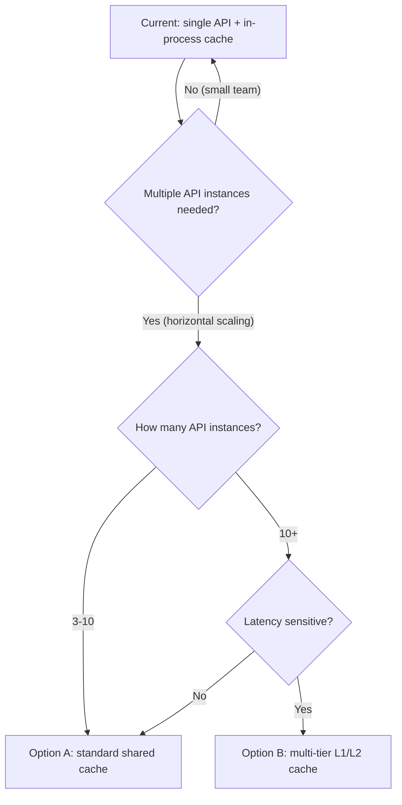

# Caching Strategy

## Current Architecture: Single-Process In-Memory Cache

```
┌─────────────────────────────────────────────┐
│  API process                               │
│                                             │
│  In-memory cache   ──> O(1) instant lookup  │
│  ├─ session token → { status }              │
│  └─ loaded at startup, updated on every     │
│     session state change                    │
│                                             │
│  Database (PostgreSQL) ──> fallback path    │
│  └─ queried only on a cache miss            │
└─────────────────────────────────────────────┘
```

### Why an in-process cache is sufficient

The target users are schools, labs, and small teams — an estimated 10–50
concurrent sessions. At that scale:

| Metric | Value | Notes |
|--------|-------|-------|
| Session table rows | <100 | Even without a cache, an index lookup is under 0.1ms |
| Cache lookup latency | ~ns | In-memory hash lookup, no I/O |
| Database round-trip | ~0.5–1ms | Network latency, not query time |
| Session handshake frequency | very low | Only at connection setup, not continuous |

**The real bottleneck is not caching but hardware resources:**

| Resource | Per session | 8GB RAM host ceiling |
|----------|-------------|----------------------|
| Session container RAM | ~200MB | ~40 sessions |
| Browser memory | ~50MB/tab | ~160 tabs |
| Network bandwidth | ~1Mbps/session | ~80 sessions |

### Why a shared cache (Redis/Valkey) is not needed

1. **Single API process** — an in-process cache is always consistent, with no
   external synchronization.
2. **No horizontal scaling** — small-team scenarios don't need multiple API
   instances.
3. **Extremely light queries** — an index lookup over 100 rows is itself
   microsecond-scale.
4. **Zero external dependency** — no extra service to deploy or maintain.

---

## Future Scaling: Shared Cache

A shared cache (Redis/Valkey) should only be considered once any of the
following conditions arise:

- Multiple API instances behind a load balancer (horizontal scaling)
- A single API process's CPU becomes the bottleneck (unlikely)
- Cross-process cache consistency is required

### Option A: Standard Shared Cache (most common)

```
API instance 1 ┐
API instance 2 ┼──> [ Redis / Valkey cluster ] ──> [ Database ]
API instance 3 ┘
```

**Architecture:**
- All API instances share one cache.
- On session state changes, the handling instance writes to the cache.
- Other instances' session validation reads the cache directly (~0.1ms).
- No local cache — simple architecture.

**Pros:**
- Simple to implement — swap the in-process cache for a cache client.
- Consistency holds naturally (single source of truth).
- TTL support lets stale entries expire automatically.

**Cons:**
- One extra network round-trip per validation.
- If the cache goes down, session validation fails for every instance.

**Best fit:** 3–10 API instances needing a simple shared cache.

---

### Option B: Multi-tier L1/L2 Cache (maximum performance)

```
API instance 1 [local (L1)] ┐
API instance 2 [local (L1)] ┼──> [ Redis / Valkey (L2) ] ──> [ Database ]
API instance 3 [local (L1)] ┘
          └─(invalidated via broadcast, or a very short TTL, e.g. 2s)
```

**Architecture:**
- L1: each instance's local cache (~ns lookups).
- L2: shared cache (~0.1ms lookups).
- Lookup order: L1 → L2 → database.
- Invalidation: broadcast invalidation, or short-TTL automatic expiry.

**Pros:**
- Most lookups hit the local tier with zero network latency.
- The shared tier acts as fallback for cross-process consistency.
- If the shared cache goes down, the local tier still serves known sessions.

**Cons:**
- Complex to implement (two tiers + a sync mechanism).
- The short-TTL option has a small inconsistency window.
- Broadcast invalidation requires managing subscriptions and reconnections.

**Best fit:** 10+ API instances with extreme latency sensitivity.

---

## Decision Flow



## Migration Path

If a future move to a shared cache is required, the plan is deliberately
low-risk:

1. **Swap the cache implementation** — the code that uses the cache keeps the
   same interface; only the storage behind it changes.
2. **Add a cache service** — deploy a Valkey service alongside the stack.
3. **Switch session validation** to the shared cache.
4. **Scale out** — run multiple API instances behind a load balancer.

Because the cache is an internal detail behind a fixed interface, none of these
steps changes how the platform behaves or how users use it.
