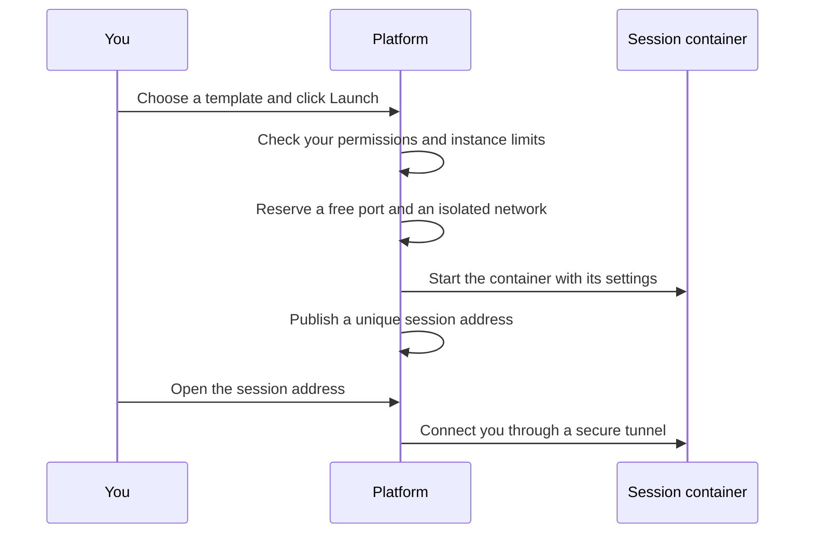
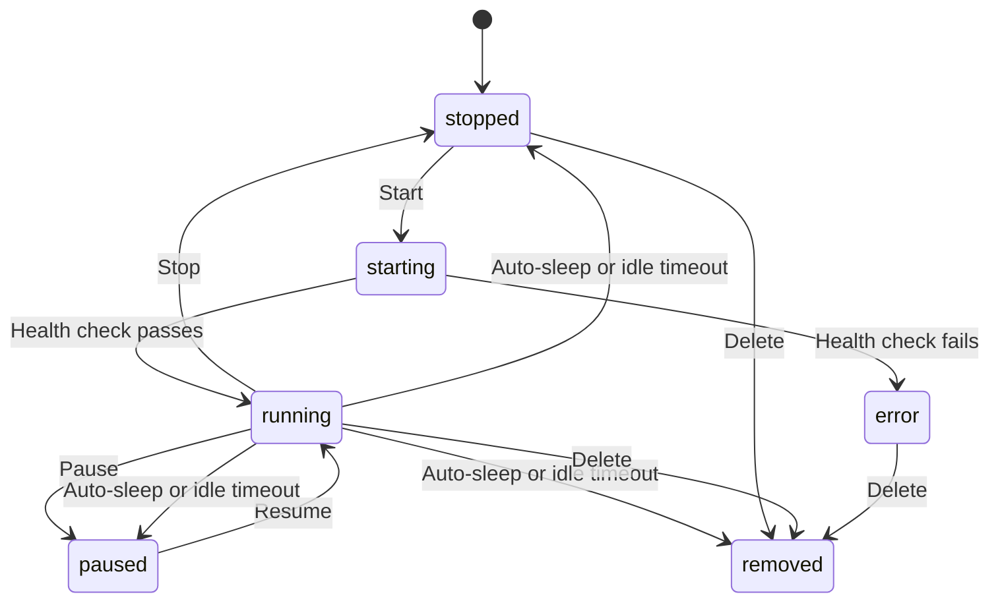

# System Architecture

## Overview

OpenWorkspace Engine turns one Linux machine into a multi-tenant virtual-desktop
platform. It provisions isolated, browser-accessible sessions on demand —
KasmVNC desktops, ttyd terminals, and Jupyter Lab notebooks — each in its own
container, each reachable through a single web address you can open in any
browser.

**Core design principle:** every session is given its own unique, unguessable
web address, and a central reverse proxy routes traffic to it. Because a new
session's routing rule is a small file the proxy hot-reloads, a session becomes
reachable the moment it starts — no proxy restart, no manual configuration.

## Terminology

| Concept | Meaning |
|---------|---------|
| **Template** | A pre-configured settings bundle — which image to run, how much CPU/RAM, bandwidth caps, time limits. Users launch sessions from templates. |
| **Instance** | A running session (KasmVNC / ttyd / Jupyter) launched from a template. |
| **User** | A person with an account. Permissions come from **groups**, not from a per-user role (see [RBAC](rbac.md)). |

The sidebar shows: **Instances** (your sessions, for everyone), **Templates**
and **Sessions** (for managers of templates or group sessions), **Volumes**
(orphaned persistent data, for user managers), **Groups** and **Users**
(administration), and **Settings** (server-wide options).

## How a Session Comes to Life

1. **Launch.** You pick a template and choose how your data is handled.
2. **Checks.** The platform confirms you may launch it and you have room
   (see [RBAC](rbac.md) for the exact rules).
3. **Resources.** A free host port and a dedicated `/30` network are reserved
   for the session, so instances can never reach each other.
4. **Start.** The container boots with the template's settings — CPU, memory,
   bandwidth caps, time limits, and the sandbox runtime.
5. **Connect.** Your session opens in the browser: a full desktop, a terminal,
   or a notebook, depending on the template (see [Remote Authentication](remote-auth.md)).

## Isolation and Safety

- Every session runs in its own container on its own tiny `/30` network —
  sessions are isolated from each other and from the management network.
- Each session is reached only through its unique, unguessable web address and
  its own credentials. Even if an attacker knew a session's internal network
  address, they could not connect without the credentials the proxy injects.
- Sessions can be sandboxed with a hardened runtime (gVisor/runsc) for an extra
  layer of isolation (see [gVisor sandboxing](../developer-guide/gvison.md)).

## Session Lifecycle

A session passes through a small set of states:

| State | Meaning |
|-------|---------|
| `running` | Active; the session address works. |
| `starting` | Booting; the platform waits for its health check. |
| `paused` | Suspended (uses almost no CPU), can be resumed. |
| `stopped` | Stopped; the container is down but your setup and data are kept. |
| `error` | Something failed at start; it can be deleted and relaunched. |

While running, a session may carry a **time budget** (a maximum runtime) and an
**idle policy** (what happens after it sits unused). These are set per template
and shown as a countdown on the session page.

## Resource Governance

The platform is built to share one machine fairly:

- **Instance ceilings** — per-user and host-wide limits on how many sessions
  can run at once (see [RBAC](rbac.md)).
- **Auto-sleep** — sessions past their time budget get the template's timeout
  action (stop, pause, or remove).
- **Keep-time** — sessions idle past a threshold are reclaimed; an in-use
  session (with an active viewer connection) never gets reclaimed.
- **Bandwidth caps** — templates can cap upload/download speed per session.

## Persistent Data

A session's home directory can live on a named volume that survives stop,
start, and even delete — only an explicit **reset** wipes it. See
[Persistent Storage](persistent-storage.md).

## Scaling

- Each session is just one small routing file for the proxy (~250 bytes),
  hot-reloaded the moment it appears — no shared state in the proxy.
- The isolated networks come from a large pool (default 16,384 `/30`
  subnets); host ports come from a configurable pool (default 10000–20000),
  both reserved without conflicts.
- A small in-process cache speeds up session validation; it is per-server and
  sufficient for a single-instance deployment (see [Caching Strategy](../developer-guide/caching-strategy.md)).

## Deployment

The platform runs as a Docker Compose stack: the reverse proxy, the API, the
web app, and the database share a control network. The development stack is
HTTP-only (browsers treat `http://localhost` as a secure context). For
production, terminate TLS in front of the stack — for example with Cloudflare
(proxied DNS) or Let's Encrypt via a front reverse proxy forwarding to port 80.

## Related docs

- [RBAC](rbac.md) — the group-based permission model
- [Remote Authentication](remote-auth.md) — how sessions are secured
- [Persistent Storage](persistent-storage.md) — what happens to your data
- [Frontend](frontend.md) — the browser UI
